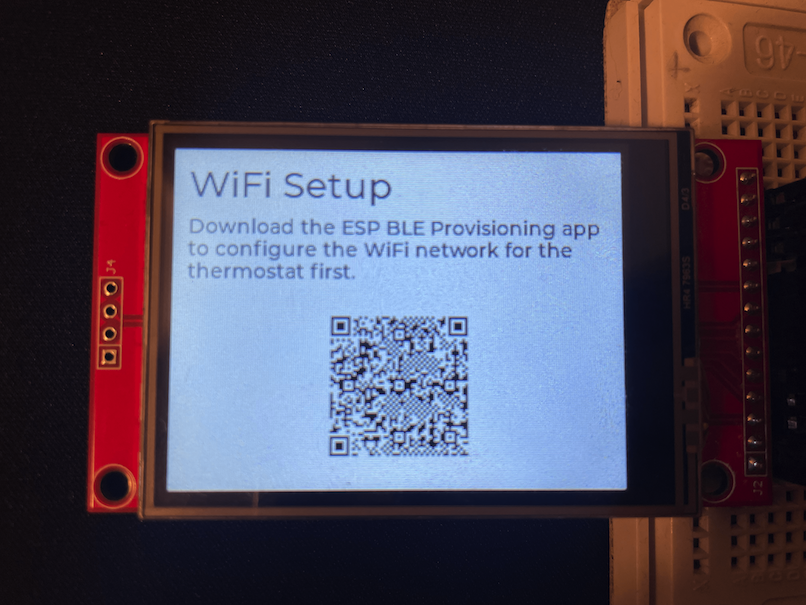
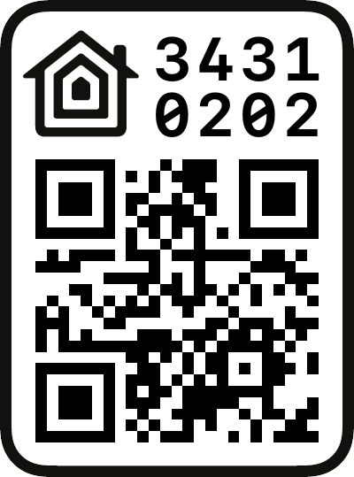
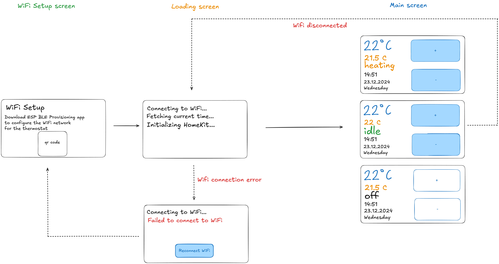
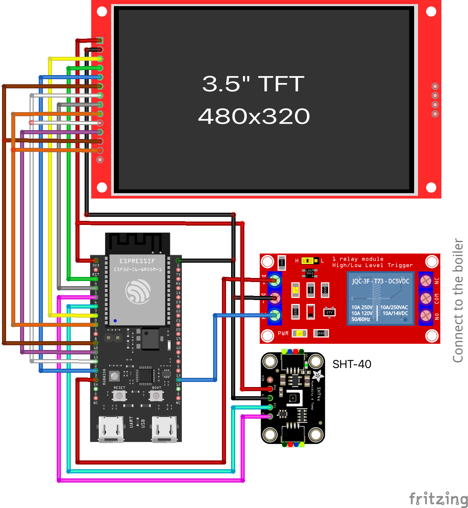

# Homekit Thermostat

> *If you want a smart thermostat that supports Homekit, they are usually quite expensive (\$150+), that's why I decided to build one myself and it cost me less than $40*

- insert a video of how it works !!!!

## How it works

This thermostat is built on **ESP32** and features an **LCD display** with a **touch screen**. The graphic interface is created using the **LVGL** library, allowing you to adjust the required temperature. It connects to a Wi-Fi network that is first configured using a **network provisioning** process and keeps its time accurate thanks to the **NTP** protocol. It uses Achim Pieters' [HomeKit library](https://github.com/AchimPieters/esp32-homekit) to communicate with the **Apple Home app**. The **SHT-40 sensor** measures the temperature, and the **relay** switches a boiler on or off based on the set temperature conditions.

### WiFi provisioning
The ESP32 uses Bluetooth Low Energy (BLE) to make the Wi-Fi provisioning process simple. When the device starts up, it creates a BLE service that can be detected by the BLE Provisioning app. Using the app, you can scan for available Wi-Fi networks, select one, and send the credentials to the ESP32. The device then connects to the provided network and saves the credentials for future use. This process ensures the device can be set up without hardcoding any Wi-Fi details.

This process is only necessary after the first start where the setup screen with a QR code will be displayed. 
Install the [ESP Provisioning](https://apps.apple.com/us/app/esp-ble-provisioning/id1473590141) app and scan the QR code to configure your WiFi network credentials first.  
After that, the Wi-Fi credentials will be stored on the device and the thermostat can connect to the configured Wi-Fi network automatically.

  

### Homekit Setup
Once you have the Wi-Fi network configured, you can add the thermostat to your Apple Home app. To do that, scan the following QR code. 
Unfortunately, these two actions cannot be done in a single step (using one QR code), as Apple doesn't support WiFi provisioning for [MFi](https://mfi.apple.com/) uncertified (custom) Homekit devices. 

  

### Time sync
The thermostat uses NTP protocol to sync the current time with the internet servers after it starts up. This ensures that the device always has accurate time.

### GUI

This thermostat consists of 3 different GUI screens that can be shown on the LCD display. The UI is built using [LVGL 8.3](https://lvgl.io/).

#### WiFi setup screen
This is the first screen the user sees when the thermostat is turned on for the first time.
On this screen, you can set up a Wi-fi network.

#### Loading screen
Once the Wi-fi network is selected, this screen is automatically displayed, showing initialization logs.   If the Wi-fi connection fails after 5 attempts, it will display the "Reconnect Wi-fi" button which will restart the provisioning flow.  
This screen is also displayed when the thermostat has been running and the Wi-fi connection is suddenly lost.

#### Main screen
This screen is displayed after everything has been initialized (WiFi, Homekit server, time, etc.). You can view the current room temperature, date & time and control the desired temperature. 
This is a two-way sync, so whenever the temperature update happens, either in a Homekit app or here on the screen, via the manual touch interaction, it will be propagated to the other side too.

### Electrical circuit
This circuit uses an [ESP32-C6](https://www.laskakit.cz/en/espressif-esp32-c6-devkitm-1-wifi-6--bluetooth-5--zigbee/) microcontroller board with the following peripherals:

#### Thermometer
For the temperature measuring, this project uses a [SHT-40](https://www.laskakit.cz/en/laskakit-sht40-senzor-teploty-a-vlhkosti-vzduchu/) sensor. It communicates with the ESP32 via I2C and measures the current temperature and humidity in 10s intervals.

| SHT-40 | ESP32 |
| --- | ---- |
| VCC | 3.3V |
| GND | GND  |
| SDA | 6    |
| SCL | 7    |

#### Relay
Once the temperature drops below the target threshold, ESP32 sends a signal to the [5V relay](https://www.laskakit.cz/en/1-kanal-5v-rele-modul-s-optickym-oddelenim--high-low-level--250vac-10a/) to turn on the boiler. Once the room reaches the required temperature, the relay will be switched off.

| Relay | ESP32 |
| --- | ---- |
| VCC | 5V |
| GND | GND  |
| IN | 12    |

#### LCD screen
This termostat is equiped with a [2.4" LCD display](https://www.laskakit.cz/en/2-4--palcovy-barevny-dotykovy-tft-lcd-displej-240x320-ili9341-spi/) with a touch screen that is connected via SPI. Both the LCD and the touchscreen share the same SPI connection.

| LCD | ESP32 |
| --- | ---- |
| VCC | 3.3V |
| GND | GND  |
| SCLK | 2  |
| MISO | 1  |
| MOSI | 10  |
| DC | 3    |
| Reset | 4 |
| CS | 0    |
| Backlight | 5 |
| T_CS | 11   |
| T_CLK | 2  |
| T_MISO | 1 |
| T_MOSI | 10 |

## 3rd party libraries
This project wouldn't be possible without these awesome libraries.

- [esp32-homekit](https://github.com/AchimPieters/esp32-homekit) by [@AchimPieters](https://github.com/AchimPieters)
- [i2cdev](https://github.com/UncleRus/esp-idf-lib/tree/master/components/i2cdev), [sht4x](https://github.com/UncleRus/esp-idf-lib/tree/master/components/sht4x) by [@UncleRus](https://github.com/UncleRus)
- [lv_qrcode](https://github.com/lvgl/lv_lib_qrcode) by [@lvgl](https://github.com/lvgl)

